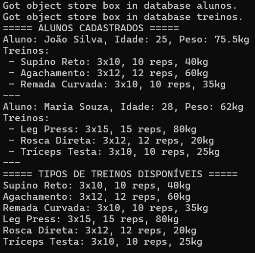
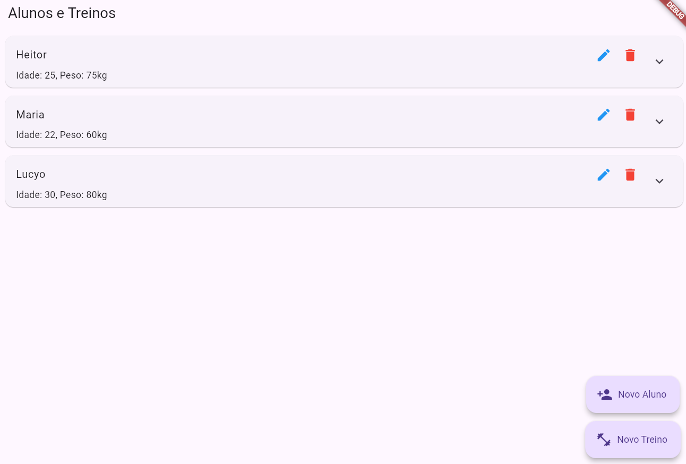
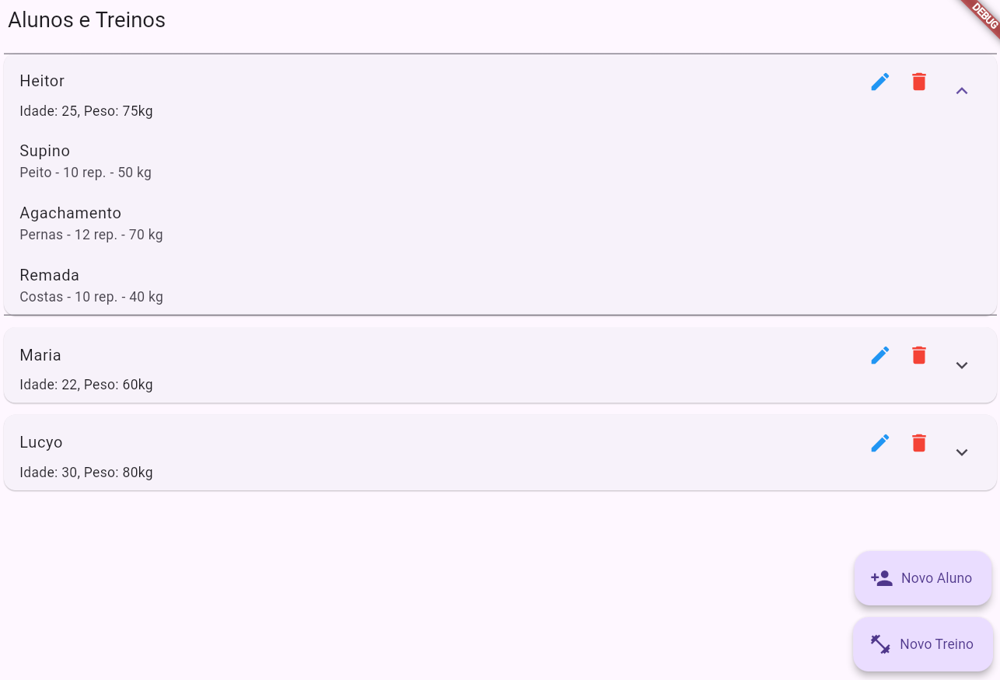
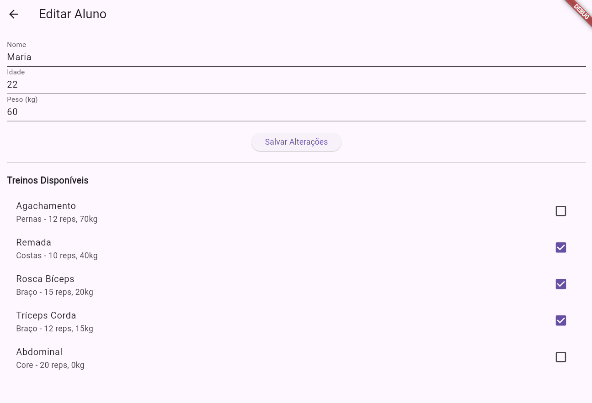
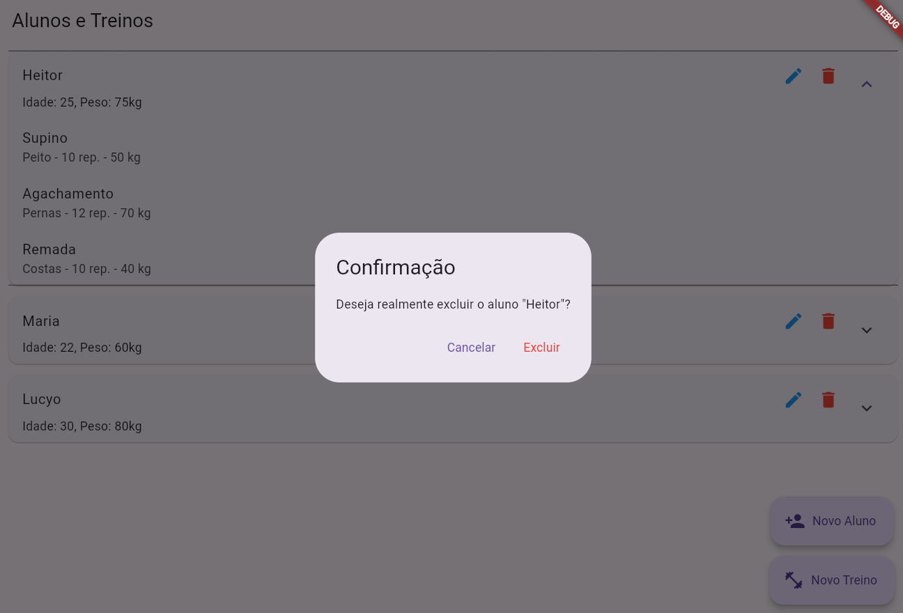
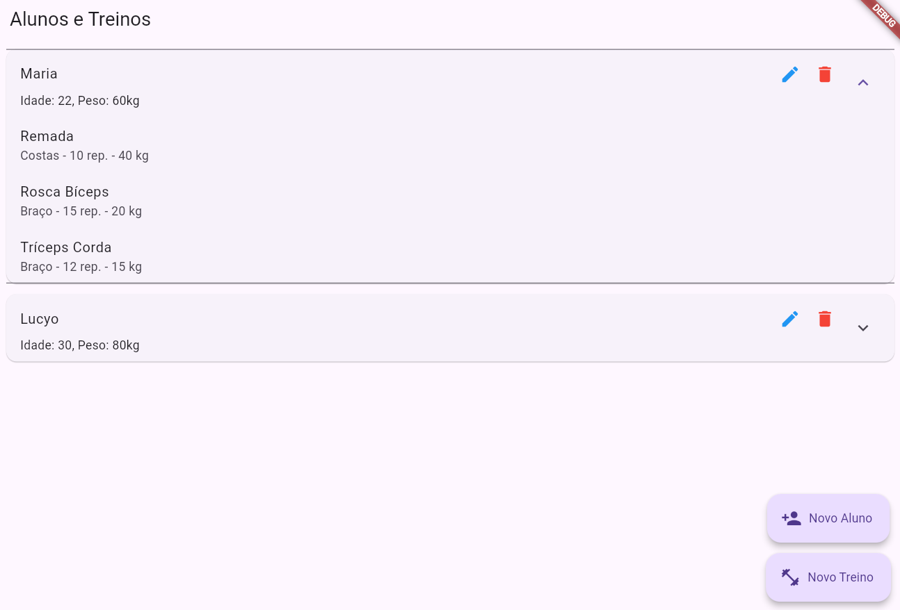
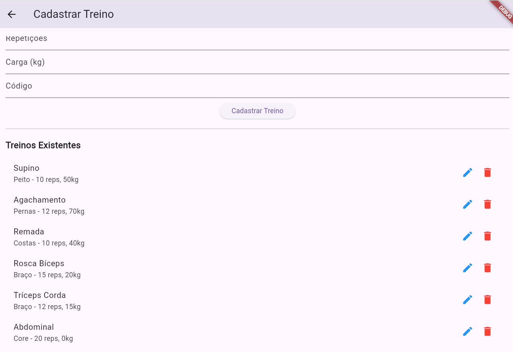
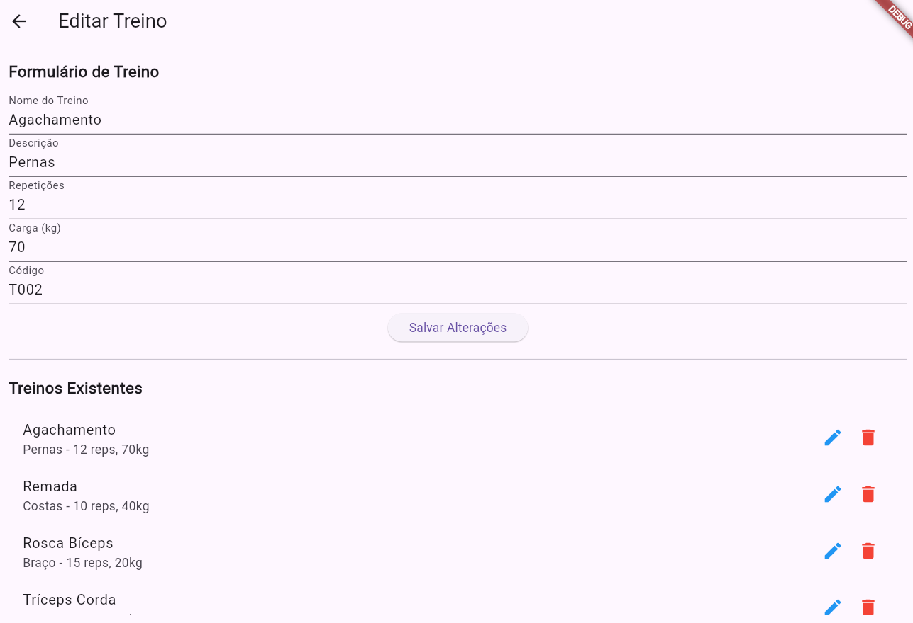
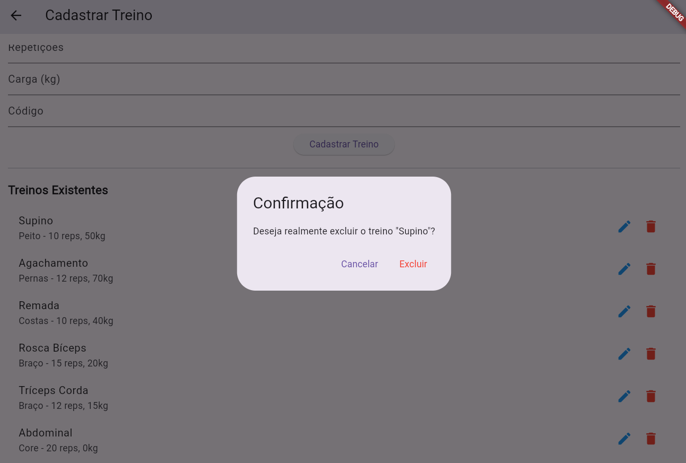
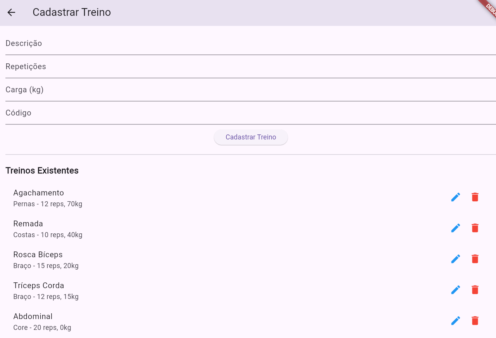

# 
💪 Projeto Academia Hive 💪
 

## 
⭐Visão Geral⭐

Objetivo: Migrar uma aplicação Flutter que antes utilizava dados em memória para uma solução com persistência local usando a biblioteca Hive, aplicando o padrão Repository para isolar o acesso ao banco de dados da interface do usuário. A aplicação usa o tema "Academia" e manipula dois conceitos: **Aluno** e **Treino**, cada um com 5 atributos. A biblioteca Hive foi escolhide por sua possibilidade de teste em ambiente tanto web quanto mobile, sua velocidade já que manipula bytes ao invés de tabelas relacionais, e sua simplicidade já que usa o sistema de chave :: valor, como em um MAP, e não necessita de uma linguagem própria como o SQLFlite.

📈Modelagem de Dados:  
- **Aluno:** id, nome, idade, peso, treinos (lista de Treino)  🧘‍♀️
- **Treino:** id, nome, descricao, repeticoes, carga 🏋️‍♂️

🖥️ Cada parte desse projeto irá aumentar a complexidade da aplicação e tratar de um aspecto, seja de CRUD ou de Testes em Flutter: 

🔥 Parte 1: 
 - **Persistencia**: 
Utiliza a biblioteca de dados Hive para salvar localmente dados da execução. Usando arquivos aluno.g.dart e treino.g.dart para abstrair as classes em formas de bytes mais simples. E utilizando do aluno_repository.dart e treino_repository.dart para encapsular a logica de acesso do Hive, representando a camada de abstração entre o Hive (Dados) e resto do App (Interface).✏️

 - **CRUD Parcial**: 
 Permite criação e leitura de dados das boxes do Hive em tempo de compilação. São criados 2 alunos e 6 tipos de treinos, armazenados nas boxes, e em seguida todos são lidos e listados.➕📄

 - **Interface Mínima**: 
 Os resultados da execução aparecem no CMD.📱

 - **Conclusão**:
Essa primeira parte do trabalho foi bem tranquila, nunca tinhamos trabalhado com persistencia de dados mobile. Foi interessante conhecer o Hive e a forma como se pode usar o repository para isolar uma camada da lógica do app, isso deixa tudo mais organizado. No inicio, tudo parecia tão complicado, mas agora usar o pubspec.yaml, alterar a pasta **lib** sem medo, e entender melhor os comandos mais comuns do flutter, se tornou facil e natural. 🏆

🔥 Parte 2: 
O que mudou da Parte 1 para a Parte 2?
 - **Interface**: 
 Agora todo o aplicativo é separado em telas e visto na interface do flutter ao invés de CMD. Foram organizadas na pasta Screen, tirando o peso de cima do "main.dart" e tornando o app mais escalavel e de fácil manutenção.📱

 - **CRUD Completo**:
 Agora a apliação possui todas as operações: criação, leitura, atualização e remoção de dados usando o repository.➕📄✏️🗑️

 - **Providers**:
 Adicionamos uma nova camada de abstração: a biblioteca Provider. Ela foi escolhida por ser popular, simples, com curva de aprendizado otima, integração direta com a UI, além de que ela usa uma abordagem chamada de InheritedWidget que é recomendada pelo Flutter para compartilhamento de estado, e por que ela permite serparar a logica de estado da lógica da UI. As camadas do projeto agora ficam: Interface > Providers > Repositories > Hive. Onde uma camada chama a outra, delegando funções especificas e segregando as lógicas: A interface chama o provider especifico, ele chama o repository apropriado com a função desejada e o repository se conecta aos dados da Box em questão no Hive. Todo provider tem como extensão ChangeNotifier, isso faz com que notifyListeners() sejam chamados sempre que uma alteração é feita, atualizando os widgets da UI com context.watch\<AlunoProvider\>() ou context.watch\<TreinoProvider\>(). 🔄

 - **Rotas Nomeadas**:
 No app, utilizamos rotas nomeadas para navegar entre telas, como a tela de cadastro de aluno ou treino. Com elas, cada tela recebe um identificador único, permitindo chamar a tela por seu nome ('/cadastro', '/cadastro_treino') em vez de instanciar o widget diretamente. Isso facilita a manutenção do código, centraliza as rotas e torna a navegação mais clara e escalável, especialmente em aplicativos com muitas telas. Os argumentos das rotas são passados usando o parâmetro "arguments" do Navigator, que envia dados da tela de listagem para a tela de edição.

 - **Formulário Validado**:
 O formulário de cadastro de aluno e treino foi construído com o widget Form e campos TextFormField, incluindo validação básica. Cada campo obrigatório possui uma função de validação que impede que o usuário envie dados vazios, garantindo integridade das informações antes de salvar. Além disso, no cadastro de aluno, é possível associar treinos existentes por seleção, demonstrando a interação entre diferentes modelos de dados.

 - **DropdownButton**:
 Foi exigido pelo comando do trabalho, a utilização de DropdownButton para vincular os models, mas sinceramente achamos as limitações desse widget bem incomodas para escalabilidade, e por isso trocamos para o uso de um conjunto de Set<Treino> com Checkboxes, isso permite selecionar varios treinos de uma vez para um mesmo aluno. Por favor não tire ponto da gente por isso kkkk.

 - **Telas**:
O programa foi dividido em 3 telas: **Tela de Cadastro de Alunos** (listagem_screen), **Tela de Cadastro e Alteração de Treinos** (cadastro_treinos_screen) e **Tela de Listas de Alunos** (cadastro_screen).
    - **Tela de Listas de Alunos**: Ela é a tela inicial e logo de cara ela já carrega 3 alunos iniciais de exemplo caso o banco de dados Hive esteja vazio. Ela lista os alunos cadastrados, e seus respectivos treinos, permitindo a exclusão dos alunos (Gerando uma caixa de confirmação, para ter certeza que quer faze-lo). Nela também existem dois botões flutuantes: "Novo Aluno" (Que leva à tela de cadastro de alunos) e "Alterar Treinos" (Que leva à tela de cadastro e alteração de treinos).🖥️

    - **Tela de Cadastro de Alunos**: Nessa tela é possivel cadastrar um novo aluno inserindo seu Nome, Idade e Peso, além de que ela lista todos os tipos de treinos permitindo escolher os treinos que deseja incluir via checkbox. Ela também possui um botão de retorno no canto superior esquerdo, que faz retornar à Tela de Listas de Alunos.🖥️

    - **Tela de Cadastro e Alteração de Treinos**: Nessa tela é possivel cadastrar um novo treino inserindo seu Nome, Descrição, Repetições, Peso e Código. Além de que ela lista todos os tipos de treinos permitindo escolher os tipos de treino que deseja excluir (Gerando uma caixa de confirmação, para ter certeza que quer faze-lo). Ela também possui um botão de retorno no canto superior esquerdo, que faz retornar à Tela de Listas de Alunos.🖥️

 - **Atributos**:
 Nos requisitos do projeto é necessário que os modelos possuam 5 atributos cada, porém o Hive Comunity Edition já cria IDs automáticos para os modelos e isso estava gerando conflito e redundancia, então o Aluno e Treino perderam o atributo ID e receberam Registro (CPF ou RG) e Código (Código que o diferencia de outros treinos, ex.: T001) respectivamente.🏋️‍♂️
 
 - **Dependencias**:
As dependencies do pubspec.yaml foram alteradas para a Comunity Edition do Hive pois o Hive comum tem bugs quando se trata do Modo Debug via Web, e isso tornava impossivel de desenvolver. O bug fazia com que a persistencia de dados quando se emulasse via web, não funcionasse. A Comunity Edition veio para corrigir esses bugs. Também foi adicionada a dependencie do Provider.⚙️

 - **Execução e Persistencia**:
 Outro Bug comum era o fato de que sempre que o "flutter run" era executado, o localhost era iniciado em outra porta diferente da anterior, e isso também causava bugs na persistencia de dados. Isso ocorria por que o Hive quando testado em mobile funciona normalmente salvando na memória do aparelho, porém em web ele cria um storage origem baseado na porta atual do localhost, esse storage é chamado de IndexedDB. Para resolver essa situação, o "flutter run" foi substituido por "flutter run -d chrome --web-port=5000", especificando a porta 5000 (Mas em seu teste você pode usar a porta que quiser, mas saiba que usará um storage diferente).💻✏️

- **Conclusão**:
Meu Deus professor, acho que nunca vimos tanto Bug acontecer em um mesmo projeto. Então é isso que chamam de "development hell", consertavamos uma coisa, e outra dava bug. Da parte 1 para a 2 foi um salto enorme kakaka. Muita coisa foi adicionada, interface, crud completo, tivemos que alterar dependencies, mexer nos models, usar o build runner sabe-se lá quantas vezes para gerar novos g.dart para os models, adicionar uma nova camada para providers, consertar bugs de persistencia que só existem na versão web do Hive. E isso porque Hive nos pareceu a melhor opção, fico imaginando como teria sido se tivessemos usado uma biblioteca que não fosse NoSQL, não quero nem pensar nisso. É rapaz, foi muito estressante, ainda mais nessa época de TCC, todo mundo correndo contra o tempo. Mas acho que ver tudo funcionando de forma responsiva e bonita, com interface funcional e CRUD 100% rodando através dela, é muito gratificante. O conhecimento do flutter e seus pormenores cresceu, e isso foi muito interessante. A sensação era de estar lutando contra um boss no Dark Souls, apanhando muito, e dando pouco dano kkkk. Mas concluindo, acredito que foi um trabalho muito proveitoso para o grupo. 🏆

🔥 Parte 3: 
A parte 3 é inexistente. Por que? Bom, era para escrever alguns testes no CRUD e Widget, simples né? Não, nenhuma das enezimas formas que tentamos para codar um teste funcionou. NENHUMA SEQUER! Nada era compativel com o Hive, ou Hive CE. Mocks não funcionavam. Nenhuma dependencia resolvia. Era tentar algo e aparecer um bug de 400 linhas, ai voce tenta resolver e buga outra coisa com 500 linhas. Aí quando você vê, está andando em circulos. Frustrante ficar tentando por 8 horas seguidas e não conseguir rodar 1 teste sem bugar. Se eu soubesse que daria tanto conflito eu teria feito o codigo em cima do SQFlite ao invés do Hive. "Ah, usa Hive, é mais simples", olha só o que a simplicidade custou. Bom, é isso, sinto muito professor, não rolou.

## 
⭐Configuração em Comum entre as Partes⭐

1️⃣ Instale o Flutter caso ainda não o possua em sua máquina. No CMD use:  

⌨️git clone https://github.com/flutter/flutter.git -b stable C:\src\flutter

Para baixar o SDK do Flutter direto do repositório do Github

2️⃣ Adicione o caminho do Flutter via CMD:

⌨️setx /M PATH "%PATH%;C:\src\flutter\bin"  

Para configurar o cominho dele.

3️⃣ Verifique o status de sua instalação no CMD com:

⌨️flutter doctor  

Para verificar se não há nada faltando (Se faltar, instale o que for pedido)

4️⃣ Crie uma pasta para abrigar o projeto. No CMD use:

⌨️flutter create nome_do_projeto  

Para criar uma pasta com ambiente Flutter que será usado para colocar os arquivos aqui disponíveis.

5️⃣ Finalmente, escolha uma das PARTES abaixo para dar continuidade.

## 
⭐Configuração e Execução Individual de cada Parte⭐

### 
✨✨✨PARTE 1✨✨✨

📁Abra a pasta **parte_1**: 

1️⃣ Adicione o pubspec.yaml:  

Copie o arquivo **pubspec.yaml** dessa pasta e cole na pasta do projeto substituindo o arquivo **pubspec.yaml** que foi gerado automaticamente por ele.

2️⃣ Instale as dependências: 

Abra o CMD na pasta do projeto e use: 

⌨️flutter pub get  

Isso fará com que todas as dependencias que especificou no pubspec.yaml sejam instaladas

3️⃣ Caso seja solicitado, ative o Modo Desenvolvedor no Windows:  

Ao tentar o Passo 2, pode aparecer uma mensagens em vermelho no CMD solicitando a ativação do modo de desenvolvedor. Use o comando:

⌨️start ms-settings:developers  

Ele te levará às configurações. Busque o Modo Desenvolvedor e o ative.

Após ativado, rode no CMD:

⌨️flutter pub get  

4️⃣ Configurando a lib:

📁Abra a pasta **lib** do seu projeto apague o main.dart

📁Abra a pasta **parte_1**: 

Copie todos os arquivos dela, exceto o arquivo **pubspec.yaml**, e cole na pasta **lib** do seu projeto

🗂️A estrutura deve ficar assim:

lib/  
 ├── models/  
 │    ├── aluno.dart  
 │    ├── treino.dart  
 │    ├── aluno.g.dart  
 │    └── treino.g.dart  
 ├── repositories/  
 │    ├── aluno_repository.dart  
 │    └── treino_repository.dart  
 └── main.dart

5️⃣ Execução:

Abra o CMD na pasta do seu projeto e rode:

⌨️flutter run

Esse comando irá te mostrará seus devices disponíveis e perguntará qual device você prefere utilizar (Eu recomendo escolher um navegador de sua preferencia, já que o Hive não funciona nativamente no Windows).

📱Ao escolher o device, aparecerá uma janela simples do flutter, mas essa parte não utilizará a UI do flutter, mas sim o CMD, por isso, é só olhar a janela do CMD e verá o resultado da compilação.

🖼️Exemplo de saída no console:

  

⚠️**OBS.: ESSE PROCEDIMENTO SÓ FUNCIONA PARA A PARTE 1, OU SEJA, SE QUISER TESTAR AS OUTRAS PARTES, DEVE APAGAR AS MUDANÇAS FEITAS NA PASTA LIB, APAGAR O ARQUIVO PUBSPEC.YAML, E SEGUIR A CONFIGURAÇÃO DA PARTE QUE QUER EXECUTAR.**⚠️

### 
✨✨✨PARTE 2✨✨✨

📁Abra a pasta **parte_2**: 

1️⃣ Adicione o pubspec.yaml:  

Copie o arquivo **pubspec.yaml** dessa pasta e cole na pasta do projeto substituindo o arquivo **pubspec.yaml** que foi gerado automaticamente por ele.

2️⃣ Instale as dependências: 

Abra o CMD na pasta do projeto e use: 

⌨️flutter pub get  

Isso fará com que todas as dependencias que especificou no pubspec.yaml sejam instaladas

3️⃣ Caso seja solicitado, ative o Modo Desenvolvedor no Windows:  

Ao tentar o Passo 2, pode aparecer uma mensagens em vermelho no CMD solicitando a ativação do modo de desenvolvedor. Use o comando:

⌨️start ms-settings:developers  

Ele te levará às configurações. Busque o Modo Desenvolvedor e o ative.

Após ativado, rode no CMD:

⌨️flutter pub get  

4️⃣ Configurando a lib:

📁Abra a pasta **lib** do seu projeto apague o main.dart

📁Abra a pasta **parte_2**: 

Copie todos os arquivos dela, exceto o arquivo **pubspec.yaml**, e cole na pasta **lib** do seu projeto

🗂️A estrutura deve ficar assim:

lib/  
 ├── models/  
 │    ├── aluno.dart  
 │    ├── treino.dart  
 │    ├── aluno.g.dart  
 │    └── treino.g.dart  
 ├── repositories/  
 │    ├── aluno_repository.dart  
 │    └── treino_repository.dart  
 ├── screens/  
 │    ├── cadastro_screen.dart  
 │    ├── cadastro_treino_screen.dart  
 │    └── listagem_screen.dart  
 ├── providers/  
 │    ├── aluno_provider.dart   
 │    └── treino_provider.dart  
 └── main.dart

5️⃣ Execução:

Abra o CMD na pasta do seu projeto e rode:

⌨️flutter run -d chrome --web-port=5000

🖼️Esse comando irá iniciar o aplicativo na tela "Listagem de Alunos", que mostra os alunos cadastrados:

  

🖼️Aqui mostra que ao clicar no nome do aluno, mostra a lista de treinos que esse aluno possui:

  

🖼️Ao clicar no botão de edição ao lado do nome do aluno, é direcionado à tela de cadastro modificada para edição, e já vai para lá com os campos preenchidos e checkboxes marcadas:

  

🖼️Ao clicar no botão de excluir, aparece uma caixa de confirmação:

  

🖼️Ao confirmar, o aluno é excluido e a tela é atualizada:

  

🖼️Ao clicar no botão de Novo Treino, vai para a tela de cadastro de treinos, onde pode ver também os treinos existentes listados:

  

🖼️Ao clicar no botão de edição ao lado do nome do treino, a tela de cadastro de treino é modificada para edição, e os campos são preenchidos:

  

🖼️Ao clicar no botão de excluir, aparece uma caixa de confirmação:

  

🖼️Ao confirmar, o treino é excluido e a tela é atualizada:

  

⚠️**OBS.: ESSE PROCEDIMENTO SÓ FUNCIONA PARA A PARTE 2, OU SEJA, SE QUISER TESTAR AS OUTRAS PARTES, DEVE APAGAR AS MUDANÇAS FEITAS NA PASTA LIB, APAGAR O ARQUIVO PUBSPEC.YAML, E SEGUIR A CONFIGURAÇÃO DA PARTE QUE QUER EXECUTAR.**⚠️

### 
✨✨✨PARTE 3✨✨✨

⚠️**OBS.: ESSE PROCEDIMENTO SÓ FUNCIONA PARA A PARTE 3, OU SEJA, SE QUISER TESTAR AS OUTRAS PARTES, DEVE APAGAR AS MUDANÇAS FEITAS NA PASTA LIB, E SEGUIR A CONFIGURAÇÃO DA PARTE QUE QUER EXECUTAR.**⚠️

